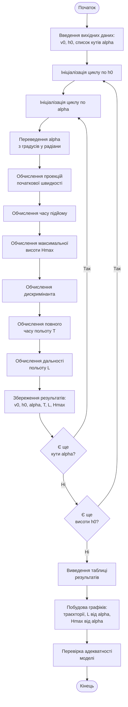

# Лабораторна робота 2: Комп'ютерне моделювання

Репозиторій містить програмну реалізацію моделі польоту тіла, кинутого під кутом до горизонту з початкової висоти.

## Запуск проєкту

```bash
# створення та активація віртуального середовища (рекомендується)
python3 -m venv .venv
. .venv/bin/activate

# встановлення залежностей
pip install numpy matplotlib prettytable

# запуск моделі
python lab2_model.py
```

## Блок-схема алгоритму

Нижче наведено блок-схему основного алгоритму обчислення характеристик польоту:



GitHub відобразить цю діаграму безпосередньо на сторінці репозиторію.