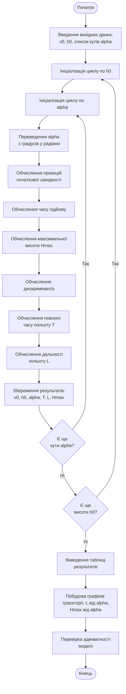

# Блок-схема алгоритму моделі польоту тіла

```mermaid
flowchart TD
    A([Початок]) --> B[Введення вихідних даних:<br/>v0, h0, список кутів alpha]
    B --> C[Ініціалізація циклу по h0]
    C --> D[Ініціалізація циклу по alpha]
    D --> E[Переведення alpha<br/>з градусів у радіани]
    E --> F[Обчислення проекцій<br/>початкової швидкості]
    F --> G[Обчислення часу підйому]
    G --> H[Обчислення максимальної<br/>висоти Hmax]
    H --> I[Обчислення дискримінанта]
    I --> J[Обчислення повного<br/>часу польоту T]
    J --> K[Обчислення дальності<br/>польоту L]
    K --> L[Збереження результатів:<br/>v0, h0, alpha, T, L, Hmax]
    L --> M{Є ще<br/>кути alpha?}
    M -->|Так| D
    M -->|Ні| N{Є ще<br/>висоти h0?}
    N -->|Так| C
    N -->|Ні| O[Виведення таблиці<br/>результатів]
    O --> P[Побудова графіків:<br/>траєкторії, L від alpha,<br/>Hmax від alpha]
    P --> Q[Перевірка адекватності<br/>моделі]
    Q --> R([Кінець])
```

Цю блок-схему GitHub автоматично відобразить як діаграму Mermaid у файлі `flowchart.md`. Для перегляду просто відкрий цей файл у репозиторії.